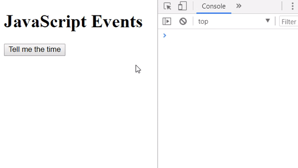
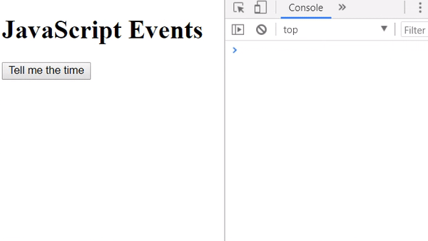
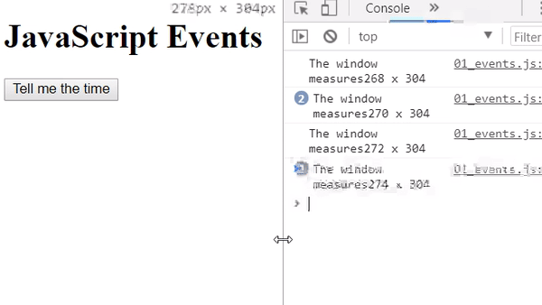
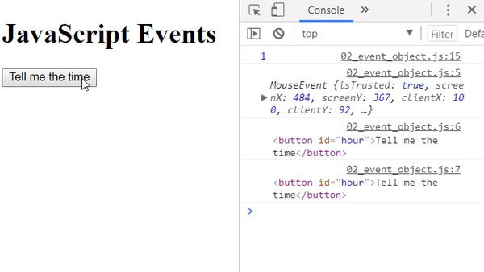
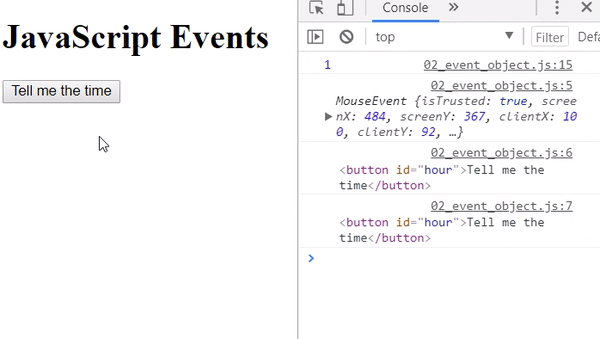
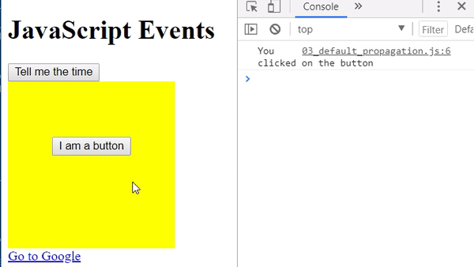
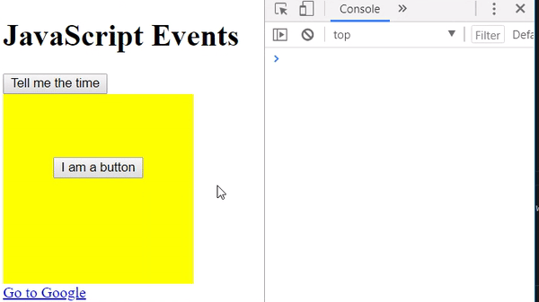
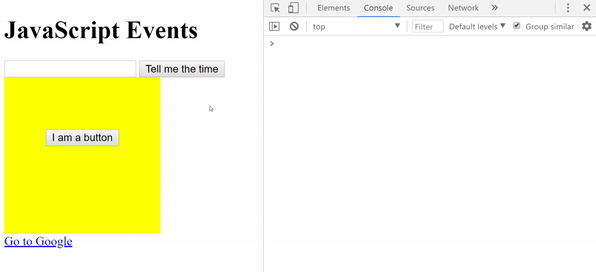
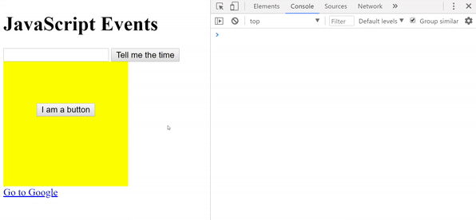

## WHAT IS AN EVENT?

Everything that happens in the application / web page.

For example:
  * That the user clicks
  * That the user plays a video
  * Have the user scroll
  * That the page loads completely

These events are captured by the browser and with JavaScript you can write functions that are executed when they are triggered.

All events are associated with an HTML element. However, it could also be associated with the global object if it is not associated with any element.

To control events, use the `addEventListener` method with the following syntax:

```js
element.addEventListener ('event', eventHandler);
```

`->eventHandler` is a function that is executed when an event is triggered.

The `eventHandler` is executed within `addEventListener`, so it does not require its invocation directly.

_[index.html](./index.html)_
```html
<!DOCTYPE html>
<html lang="en">
  <head>
    <title></title>
    <meta charset="utf-8">
    <meta name="viewport" content="width=device-width, initial-scale=1, maximum-scale=1" /> </head>
    <link rel="stylesheet" href="styles.css">
  <body>
    <h1>JavaScript Events</h1>
    <button id="hour">Tell me the time</button>
    <script src="01_events.js"></script>
  </body>
</html>
```

> When you use the format `(function(){/*.. code ...*/})();`, your code will be executed automatically.

### Exercise: event click alert
_[01_events.js](./01_events.js)_
```js
(function(){
  'use strict';
  var myAlert = function(){
    alert("you clicked");
  };
  addEventListener('click',myAlert); // associated with the global object
})();
```

  

### Exercise: event click hour
_[01_events.js](./01_events.js)_
```js
(function(){
  'use strict';
  var hourButton = document.getElementById('hour');
  hourButton.addEventListener('click', function(){
    var date     = new Date(),
        hour      = date.getHours(),
        minutes   = date.getMinutes(),
        seconds  = date.getSeconds();
    alert("The current time is " +  hour + ":" + minutes + ":" + seconds);
  });
})();
```



### Exercise: resize window
_[01_events.js](./01_events.js)_
```js
(function(){
  addEventListener('resize', function(){
      var w = window.innerWidth,
      h = window.innerHeight;
      console.log('The window measures' + w + ' x ' + h);
  });
})();
```




## THE EVENT OBJECT 
  
It is an object that contains all the information related to a specific event. If we want to access this object, just pass a parameter to the event handler. This can be called in any way but it is customary to call it "event" or "e".


_[index.html](./index.html)_
```diff
<!DOCTYPE html>
<html lang="en">
  <head>
    <title></title>
    <meta charset="utf-8">
    <meta name="viewport" content="width=device-width, initial-scale=1, maximum-scale=1" /> </head>
    <link rel="stylesheet" href="styles.css">
  <body>
    <h1>JavaScript Events</h1>
    <button id="hour">Tell me the time</button>
--    <script src="01_events.js"></script>
++    <!--<script src="01_events.js"></script>-->
++    <script src="02_event_object.js"></script>
  </body>
</html>
```

### Exercise: click button
_[02_event_object.js](./02_event_object.js)_
```js
(function(){
  'use strict';
  var boton = document.getElementById('hour');
  boton.addEventListener('click', function(event){
    console.log(event);
    console.log(event.target);
    console.log(this);
  });
})();
```


A number representing a given button:

0: No button
1: Left button
2: Middle button (if present)
3: Right button
For a mouse configured for left-handed use, the button actions are reversed. In this case, the values are read from right to left.

### Exercise: block right click of the page
_[02_event_object.js](./02_event_object.js)_
```js
(function(){
  'use strict';
  window.addEventListener('mousedown', function(e){
    console.log(e.which); // returns the code of the button pressed
    if(e.which === 3) {
      alert("It is forbidden to copy content from this page");
    }
    e.preventDefault();
  });
})();
```



## PROPAGATION OF EVENTS

It means that when an event occurs, it also happens in all its ancestors until it reaches the document.

The `.stopPropagation()` method of the event object stops propagation.

### Exercise: stopPropagation
_[03_default_propagation.js](./03_default_propagation.js)_
```js
(function(){
  'use strict';
  var container = document.getElementById('container'),
      button = document.getElementById('button');
  button.addEventListener('click', function(e){
    console.log("You clicked on the button");
    e.stopPropagation();
  });
  container.addEventListener('click', function(){
    console.log("You clicked on the container");
  });
})();
```



## PREVENT DEFAULT

Browsers have a default behavior for certain events. For example, go to a resource when it is clicked, or move the scroll when the keyboard arrows are pressed.

The `preventDefault ()` method of the event object cancels the browser's default behavior.

### Exercise: preventDefault
_[03_default_propagation.js](./03_default_propagation.js)_
```js
(function(){
  'use strict';
  var ed = document.getElementById('Google');
  ed.addEventListener('click', function(e){
    console.log("You will be directed to the Google page");
    e.preventDefault();
  });
})();
```




## MOUSE EVENTS

* `mousedown`, when a button is pressed (before releasing it)
* `mouseup`, when a button is released
* `click`, when the left button is pressed
* `dblclick`, when you press the left button twice
* `mousemove`, when the mouse moves
* `mouseenter`, when the mouse enters the element area
* `mouseleave`, when the mouse leaves the element area


### Exercise: drawing program
_[04_mouse_events.js](./04_mouse_events.js)_
```js
(function(){
  'use strict';
  var draw = function(e){
    var point = document.createElement('div');
    punto.classList.add('point');
    punto.style.left = (e.pageX - 10) + 'px';
    punto.style.top = (e.pageY - 10) + 'px';
    punto.style.background = 'tomato';
    document.body.appendChild(point);
  };
  addEventListener('mousedown', function(){
    addEventListener('mousemove', draw);
    addEventListener('mouseup', function(){
        removeEventListener('mousemove', draw);
    });
  });
})();
```


## KEYBOARD EVENTS

* `keydown`, when a key is pressed (before releasing it)
* `keyup`, when a key is released
* `keypress`, when you press a key that prints a character

### Exercise: Know which key was pressed
_[05_keyboard_events.js](./05_keyboard_events.js)_
```js
(function(){
  'use strict';
  addEventListener('keydown', function(e){
    console.log(e);
    // a is 65, b is 66 ...
    switch (e.which) {
      case 65:
        console.log("You pressed the A key");
        break;
      case 66:
        console.log("You pressed the B key");
        break;
      case 67:
        console.log("You pressed the C key");
        break;
      default:
        // statements_def
        break;
    }
  });
})();
```



### Exercise: two-key keyboard shortcuts

// y ->	89
_[05_keyboard_events.js](./05_keyboard_events.js)_
```js
(function(){
  'use strict';
  addEventListener('keydown', function(e){
    // console.log(e.which);
    if(e.ctrlKey === true && e.altKey === true && e.which === 89){
      alert("Welcome to the game");
    }
  });
})();
```



### Exercise: keylogger
_[05_keyboard_events.js](./05_keyboard_events.js)_
```js
(function(){
  'use strict';
  var keylogger = document.getElementById('keylogger');
  var keylog = "";
  keylogger.addEventListener('keyup', function(){
    keylog = this.value;
    console.log(keylog);
  });
})();
```


## FORMULARY EVENTS

* `focus`, When a field is activated
* `blur`, When you leave a field
* `change`, When changing the value of a select, input or textarea
* `submit`, When the form is sent (this event is associated with the complete form, not the input submit)

### Exercise: detect the selected option
_[06_form_events.js](06_form_events.js)_
```js
(function(){
  'use strict';
  var pais = document.getElementById('country');
  pais.addEventListener('change', function(){
    console.log('Your country is' + this.value);
  });
})();
```

### Exercise: detect if a checkbox or radio button is selected
_[06_form_events.js](06_form_events.js)_
```js
(function(){
  'use strict';
  var check = document.getElementById('check');
  check.addEventListener('change', function(e){
    if(e.target.checked){
      alert("Thanks for subscribe to our newsletter");
    } else {
      alert("We regret your decision =(");
    }
  });
})();
```